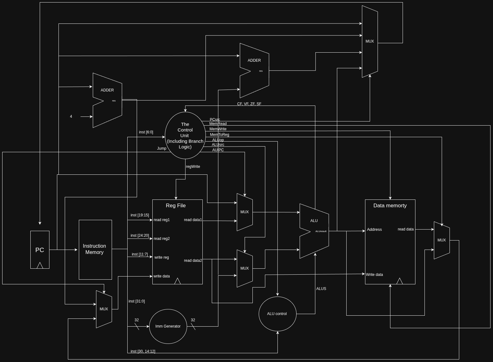

# ⚙️ femtoRV32 – Pipelined RISC-V Processor

## 🧠 Overview
This project implements a **pipelined RV32I RISC-V processor** on the **Nexys A7 FPGA** board.  
It is developed in **two main stages**:

1. **🔹 Single-Cycle Processor**  
   - Designed and tested in the lab.  
   - Implements all **42 RV32I base integer instructions** (excluding the acutal implementation of `ECALL`, `EBREAK`, `PAUSE`, `FENCE`, and `FENCE.TSO`, which are considered as halting instructions).  
   - Uses separate instruction and data memories for simplicity in the initial stage.

2. **🔹 Pipelined Processor**  
   - Builds on the single-cycle design by introducing **pipeline registers** between stages.  
   - Implements **every-other-cycle instruction issuing** to handle structural hazards due to the single-ported memory design.  
   - Supports hazard handling (data, control, and structural) to ensure correct execution.  
   - Uses a **single unified memory** for both instructions and data.

---

## 🧩 Processor Pipeline
The processor executes each instruction in **6 clock cycles**, divided into **3 stages**, each lasting two cycles:

- **Stage 0:** Instruction Fetch (C0) and Register Read (C1)  
- **Stage 1:** ALU Operation (C0) and Memory Access (C1)  
- **Stage 2:** Write Back (C0), with C1 unused  

This structure maintains an effective CPI of 2 while ensuring correct synchronization between memory and computation.

📸 **Pipeline Diagram:**  
*(Insert diagram here)*

---

## 🚀 Features
- ✅ Full support for the **RV32I** base instruction set  
- 🧮 Hazard detection and forwarding logic for data dependencies  
- 💾 Unified single-ported, byte-addressable memory  
- 🧱 Modular Verilog design (ALU, Control Unit, Immediate Generator, etc.)  
- 🧪 Thorough test cases covering all instructions and hazards  
- ⚡ Tested on the **Nexys A7 FPGA board**

📸 **Datapath Diagram:**  

---

## 🏆 Bonus Features (Optional)
- ➕ Support for compressed instructions (**RV32IC**)  
- ✖️ Integer multiplication/division (**RV32IM**)  
- 🔁 2-bit dynamic branch prediction  
- ⏩ Early branch evaluation in the ID stage  
- 🧰 Alternative solutions for single-memory structural hazards  
- 🎲 Random instruction test program generator

---

## 📁 Project Structure
## 📂 Project Directory Structure

- `femtoRV32/`  
  - `Verilog/` — All Verilog source files  
  - `Test/` — Test programs and memory initialization files  
  - `Journals/` — Activity logs for each team member  
  - `Report.pdf` — Design documentation and testing proof  
  - `README.md` — This file

---

## 🧾 Testing and Validation
The processor is tested on the **Nexys A7 FPGA board**, using:
- Custom test programs for each instruction  
- Hazard test cases (data, control, and structural)  
- Optional RISC-V compliance tests from the official suite  

📸 **Testing Waveform Screenshots:**  
*(Insert simulation screenshots here)*

---

## ⚠️ Known Issues / Assumptions
- `ECALL`, `EBREAK`, `PAUSE`, `FENCE`, and `FENCE.TSO` are treated as halting instructions  
- Every-other-cycle instruction issue is used to avoid memory access conflicts  
- CPI ≈ 2 due to the structural hazard handling technique  

---

## 👥 Team Members
- **Marcelino Sedhum** – [900231128]  
- **Mennatallah Zaid** – [900232367]  

---

## 📚 References
- [📘 The RISC-V Instruction Set Manual, Volume I: Unprivileged Architecture](https://riscv.org/specifications/ratified/)  
- [🧩 RISC-V Compliance Test Suite (rv32i_m)](https://gitlab.com/incoresemi/riscof/-/tree/master/riscof/suite/rv32i_m/I)

---
✨ *Designed with precision and passion for CSCE 3301 – Computer Architecture (Fall 2025)* ✨
